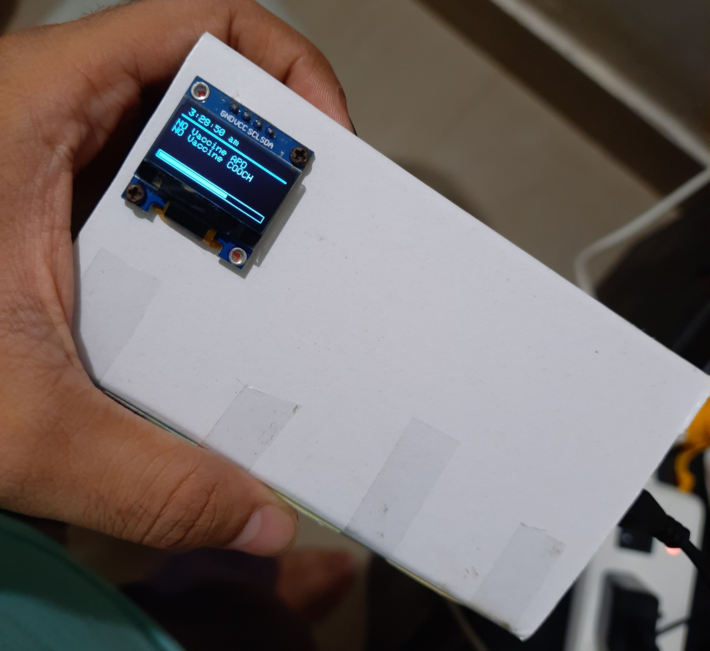
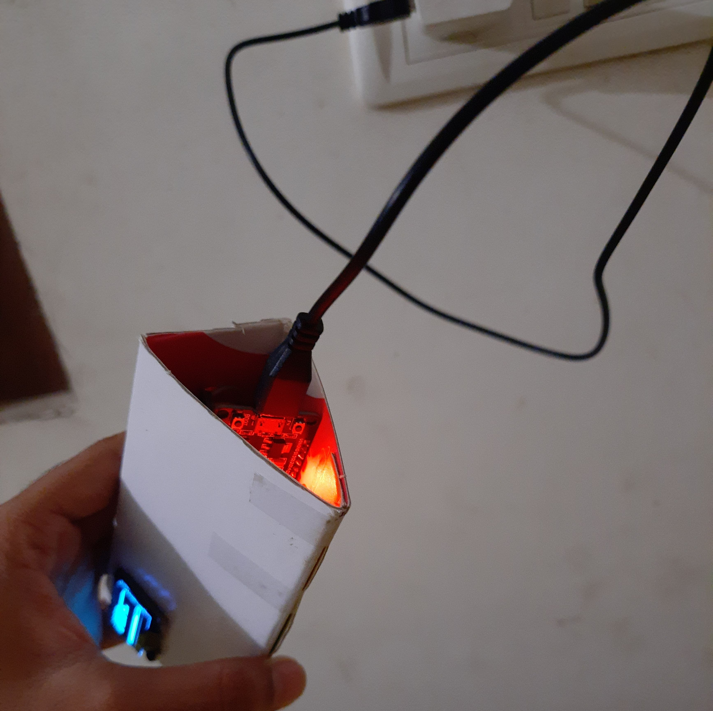

# COWIN__ALERT
## A ESP32 based server to continuously check for avaliable stots in cowin portal
### And play some buzzer if there is available slots

Initial thoughts were to use a server to simplify the response, but cowin has blocked requestes from those servers(free)...

so, the ino sketch does all the work itself..
it connects to wifi,fires an NTP client, checks for update regarding vaccine in every 3 mins
if there is vaccine available, it starts buzzing and beeping.....

